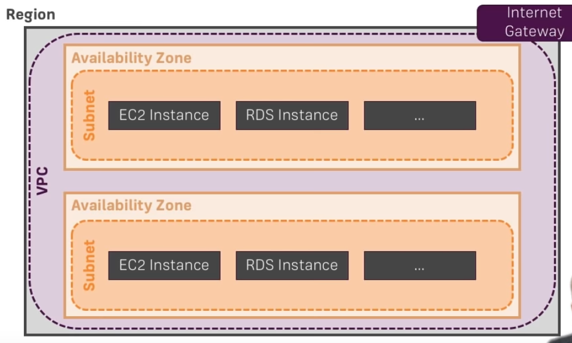
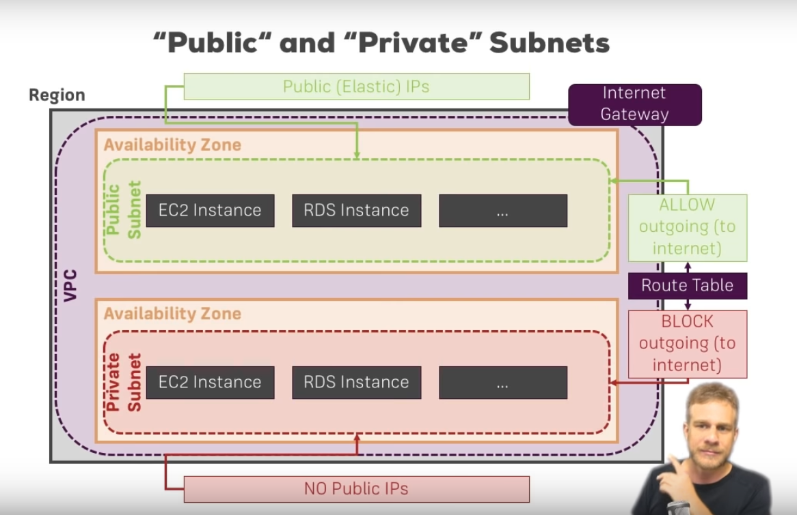

## Region
> Grupo de Data Centers que são separados por onde se encontram geograficamente.

 

## Avaliabity Zone
> São data centers que fisicamente estão separados (sistema de refrigeração, energético) mas estão geograficamente mais próximos.

> Avaliabity zones da mesma região possuem uma rede privada, então os dados podem ser tranferidos de forma privada e rápida entre elas.

 

## VPC 
> VPC permite criar uma rede privada, onde posso configurar quem pode acessar (fazer requisições). É sempre necessário ao pelo menos uma VPC.

> A VPC é associada à uma única região.

> É possível determinar uma faixa de IPs interno de um VPC (Ex: 1.1.1.1 à 100.100.100.100).

 

## Subnets
> São redes menores dentro do VPC em que cada uma pode estar em uma Avaliabity Zone diferente.

> É possível colocar diferentes instâncias do seu projeto em diferentes subnets. ~Pesquisar o porquê~

> Cada Subnet pode ter uma faixa subconjunto de IPs diferentes. Então uma subnet poderia ter de 1.1.1.1 à 10.10.10.10 e outra de 15.15.15.15 à 20.20.20.20. 

 

## Instância 
> Existem vários tipos de instância, uma EC2, por exemplo, é uma maquina virtual hospedada no AWS.

 

 

## Bucket (S3)
Basicamente uma pasta onde sao adicionários vários arquivos para que esteja disponíveis na web.

   

## Porque usar Subnets e VPCs?

1. Controle de acesso
    - Securitu Group: Define as configurações de segurança de uma instância. Funciona como um Firewall, determinando o que entra e sai. (Estão associados aos VPCs).
    - Network Acess Control List (NACL): Define as configurações de segurança de uma subnet.

2. Controlar Routing
    - É feito no nível das subnets. Não entendi a diferenteça entre controle de routing e  acesso.
    - Define se a instância deve ou não receber/acessar um IP público, já que por default elas podem (e não vai querer seu banco de dados nas interwebs).

 

O exemplo acima mostra um VPC que possui uma subnet pública e uma privada . 
Na pública poderia estar o site que deve ser acessado pelos usuários. Na privada poderia estar o BD que não deve ser acessado por ninguém fora da VPC.

Desta forma o site que é público pode acessar facilmente o BD.

    

# Dúvidas

## 1. Porque colocar diferentes instâncias do projeto em diferentes subnets?

## 2. Qual a diferença entre 'Acesse control' e 'Routing Control'?